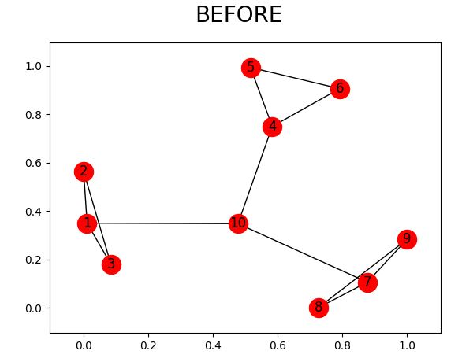
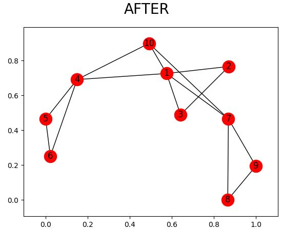

# Gelling, and Melting, Large Graphs by Edge Manipulation

This is an algorithm which is about **K-EdgeDeletion και K-EdgeAddition**. Is written in **Python 3.X** and is based on the article 
Hanghang Tong, B. Aditya Prakash, Tina Eliassi-Rad, Michalis Faloutsos, and Christos Faloutsos. 2012. Gelling, and melting, large graphs by edge manipulation. In Proceedings of the 21st ACM international conference on Information and knowledge management (CIKM '12). ACM, New York, NY, USA, 245-254.

You can find the **article** [here](http://www.cs.cmu.edu/~christos/PUBLICATIONS/cikm12-netgel.pdf).

This work was given as a bonus project from [Panos Louridas](https://github.com/louridas) in course **Algorithms and Data Structures** (*Department of Forest Science and Technology*, Athens University of Economics and Business).
You can find the assignment [here](http://nbviewer.jupyter.org/github/dmst-algorithms-course/assignment-2017-bonus/blob/master/assignment_2017_bonus.ipynb).

To run the program:

python gelling_melting.py [-h] [-g] [-d] [-s SEPARATOR] [-f] graph num_edges

* positional arguments:
  * graph		graph file
  * num_edges	number of edges to delete / add

* optional arguments:
  * -h, --help			show this help message and exit
  * -g, --gell			gell graph
  * -d, --directed		directed graph
  * -s, --separator		SEPARATOR
  * -f, --figure		draw the graph before and after the k-edge deletion / addition

**Example:** For the file [graph.txt](graph.txt) 
`python gelling_melting.py graph.txt 2 -g -s -f:` the output is:

```
((1, 7), 0.14202618512757398)
((1, 4), 0.14202618512757384)

which mean that we added the edge 1-7 and 1-4

```



* The algorithm also works for big graphs. Specifically, it should be able to produce results for the newest [AS Graph Data Set](http://topology.eecs.umich.edu/archive/asgraph_new.tar.gz) (not directed, see [here](http://topology.eecs.umich.edu/data.html) for information), as well as for a [subset of the Facebook graph](https://snap.stanford.edu/data/facebook_combined.txt.gz) (not directed, see [here](https://snap.stanford.edu/data/egonets-Facebook.html) for information), or the [Twitter graph](https://snap.stanford.edu/data/twitter_combined.txt.gz) (directed, information [here](https://snap.stanford.edu/data/egonets-Twitter.html)). For example, on an Ocean Machine with 2 CPUs and 4 GB of RAM, less than 6 seconds are required for the Facebook graph and less than 1.5 minutes for the Twitter graph to identify 10 links to delete.